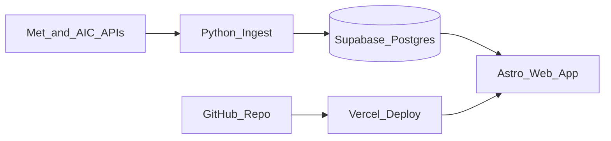

# Paintings Explained

Paintings Explained is a small web app for exploring public-domain paintings.
Visitors can browse famous artworks, zoom into the image, and tap hotspots to
learn the hidden details that make each painting worth studying.

The app is built with:

- Astro for the website in [`web/`](web/)
- Supabase Postgres for paintings, artists, hotspots, tags, and page content
- A Python importer in [`ingest/`](ingest/) for curated public-domain starter data
- Vercel for hosting, with the project root set to [`web/`](web/)

## Project Structure

```text
paintings-explained/
+-- db/migrations/     Supabase schema and Row Level Security policies
+-- ingest/            Python script and seed data for importing paintings
+-- web/               Astro website
+-- DEPLOY.md          Detailed Vercel deployment notes
`-- README.md          This guide
```

## Quick Start

Use these steps when setting up the project on a new machine.

### 1. Install Requirements

- Node.js `>=22`
- Python 3
- Access to the existing Supabase project values

Check Node:

```bash
node -v
npm -v
```

### 2. Install Web Dependencies

```bash
(cd web && npm install)
```

If you prefer a lockfile-only install after `package-lock.json` is up to date,
use `npm ci`.

### 3. Configure Local Environment

From the project root, copy the example env files:

```bash
cp web/.env.example web/.env
cp ingest/.env.example ingest/.env
```

Fill the values from Supabase and Vercel. See
[Environment Variables](#environment-variables) below for what each value does.

### 4. Run The Website

```bash
(cd web && npm run dev)
```

Open <http://localhost:4321>.

## Environment Variables

### Website

Set these in `web/.env` for local development and in Vercel for production.
Use [`web/.env.example`](web/.env.example) as the template:

```bash
SUPABASE_URL=https://YOUR-PROJECT-ref.supabase.co
SUPABASE_ANON_KEY=your-anon-public-key
SITE_URL=https://your-production-domain.example
```

`SUPABASE_ANON_KEY` is safe for the website because database access is limited by
Supabase Row Level Security. Public users should only be able to read published
content.

Optional website variables:

```bash
NEWSLETTER_ACTION=
PUBLIC_FINGERPRINT_API_KEY=
PUBLIC_FINGERPRINT_REGION=us
```

### Importer

Set these in `ingest/.env`. Use [`ingest/.env.example`](ingest/.env.example)
as the template:

```bash
SUPABASE_URL=https://YOUR-PROJECT-ref.supabase.co
SUPABASE_SERVICE_ROLE_KEY=your-service-role-key
```

Keep `SUPABASE_SERVICE_ROLE_KEY` secret. It bypasses Row Level Security and must
never be exposed in the browser or committed to Git.

## How The App Works



The website reads published content from Supabase at request time. Content
changes in Supabase can appear without a code deploy. Code changes are pushed to
GitHub and deployed by Vercel.

## Database Setup

For a new Supabase project:

1. Create a Supabase project.
2. Open the SQL Editor.
3. Run [`db/migrations/001_schema.sql`](db/migrations/001_schema.sql).
4. Run [`db/migrations/002_rls.sql`](db/migrations/002_rls.sql).
5. Copy the Project URL, anon public key, and service role key from Supabase
   Project Settings -> API.

If you are continuing from the existing deployed app, you usually do not need to
rerun migrations. Use the same Supabase project values that production uses.

## Working With Content

There are two ways to add or update paintings.

### Edit In Supabase

Use Supabase Table Editor for quick content changes:

- Add or update rows in `paintings`.
- Set `published = true` for paintings that should appear on the site.
- Set `featured = true` for paintings that should appear on the homepage.
- Add hotspot rows in `hotspots`; `x` and `y` are percentages from `0` to `100`.
- Edit `summary`, `why_watch`, and `body` for the visible explanation text.

### Import From Seed Data

Use this flow when adding curated public-domain paintings through code:

```bash
cd ingest
python3 -m venv .venv
./.venv/bin/pip install -r requirements.txt
cp .env.example .env
./.venv/bin/python ingest.py --dry-run
./.venv/bin/python ingest.py
```

Edit [`ingest/seed_data.py`](ingest/seed_data.py) to add or change seeded
paintings. Re-running the importer is intended to be safe; it upserts existing
data instead of duplicating paintings.

## Common Commands

```bash
# Start local website
(cd web && npm run dev)

# Build production website
(cd web && npm run build)

# Preview the production build locally
(cd web && npm run preview)

# Dry-run painting import without writing to Supabase
(cd ingest && ./.venv/bin/python ingest.py --dry-run)
```

## Deploying

The deployed site runs on Vercel.

For the GitHub + Vercel flow:

1. Push changes to GitHub.
2. In Vercel, import the GitHub repo if it is not already linked.
3. Set the Vercel Root Directory to `web`.
4. Add production env vars: `SUPABASE_URL`, `SUPABASE_ANON_KEY`, and `SITE_URL`.
5. Add optional env vars like `NEWSLETTER_ACTION` or
   `PUBLIC_FINGERPRINT_API_KEY` if those features are enabled.
6. Deploy.

See [`DEPLOY.md`](DEPLOY.md) for the full deployment walkthrough.

## Troubleshooting

### `node` or `npm` is not found

Install Node.js `>=22`, then reopen the terminal or source your shell config:

```bash
source ~/.zshrc
node -v
npm -v
```

### `npm install` fails with `403 Forbidden`

If npm fails while downloading a package tarball, it is usually a network,
proxy, VPN, or firewall issue. Confirm with:

```bash
curl -I https://registry.npmjs.org/nanoid/-/nanoid-3.3.14.tgz
```

If that also returns `403`, switch networks, disable the blocking proxy/VPN, or
allowlist `registry.npmjs.org`.

### Website starts but data is missing

Check that `web/.env` has the correct `SUPABASE_URL` and `SUPABASE_ANON_KEY`.
Also confirm the painting rows in Supabase have `published = true`.

### Ingest dry-run returns `ProxyError 403`

The importer calls external museum APIs from the Met, Art Institute of Chicago,
and Wikimedia Commons. A `ProxyError 403` means the current network blocked those
requests. Run the importer from a network with outbound access to those domains.

### Vercel deploy cannot find the app

Make sure the Vercel project Root Directory is set to `web`.
